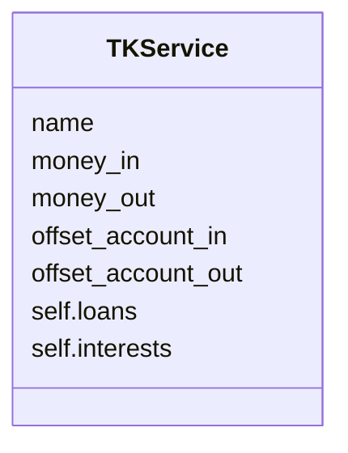
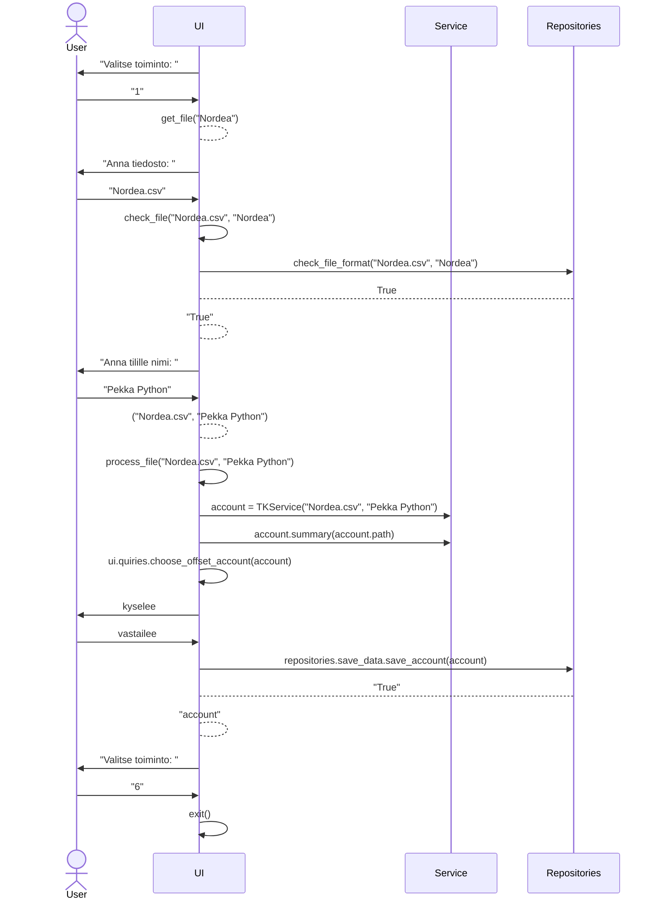
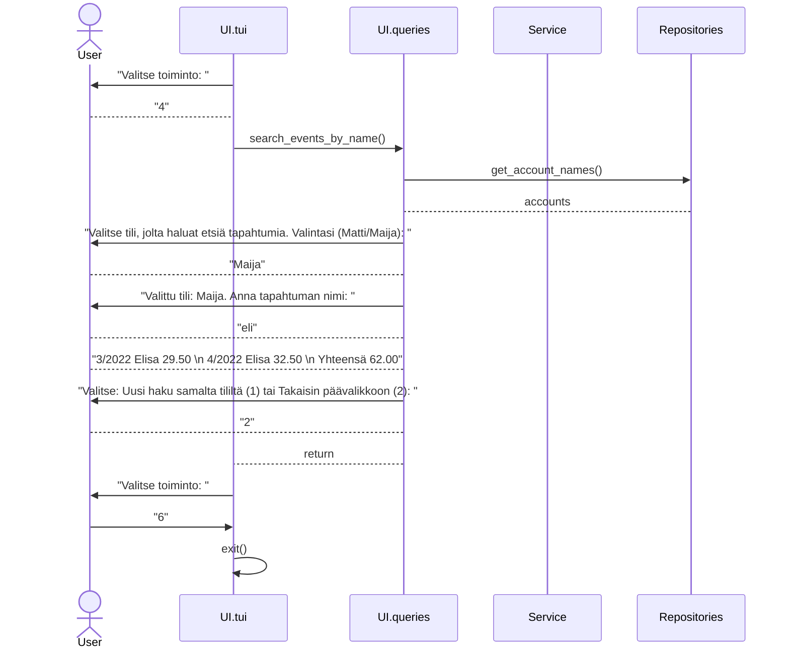

# Kuvaus arkkitehtuurista

## Ohjelman rakenne

Ohjelma koostuu käyttöliittymästä, sovelluslogiikasta ja pysyväistallennuksesta. Käyttöliittymän
alaisuudessa on toimintoja, jotka luonteeltaan ovat käyttöliittymän ja sovelluslogiikan välimaastosta,
sisältäen kuitenkin enemmän käyttöliittymän tyyppisiä toimintoja. 

Sovelluslogiikka käsittelee käyttöliittymän kautta saatuja tietoja ja prosessoi ne muotoon, josta
pysyväistallennuksen kerros saa helposti tallennukseen tarvittavat tiedot. 

## Ohjelman pakkausrakenne

Ohjelma on pakattu toimintoja kuvaaviin kansioihin. UI-kansiossa on käyttöliittymä ja käyttöliittymää
lähellä olevat kyselyt/toiminnot. Service-kansiossa on sovelluslogiikka ja Repositories-kansiossa on 
ohjelman pysyväistallennuksesta vastaavat toiminnot. 

## Päätoiminnallisuus

Ohjelmassa tällä hetkellä olevat toiminnot ovat S-Pankin ja Nordean tiliotetiedoston lisääminen, tilitapahtumien etsiminen ja raporttien tulostaminen sekä tilien yhdistäminen.

Ohjelman käyttö edellyttää aluksi tilitiedoston lisäämistä. Ohjelma pyytää käyttäjää luokittelemaan tilitapahtumat ja tämän jälkeen tilitiedot tallennetaan pysyväismuistiin. Tilitiedoston tallennuksen jälkeen kaikki toiminnot perustuvat pysyväisesti tallennettuun tietoon. Tilitietoja voi hakea tilitapahtuman nimen perusteella. Tulostettavien raporttien vaihtoehdot ovat tuloslaskelma, kassavirtalaskelma ja muutokset tase-erissä. Jos useampia tilejä on tallennettu, näiden tiedot on mahdollista yhdistää. Yhdistämisen jälkeen yhdistetylle tilille on käytössä samat toiminnot kuin muillekin tileille.

### Ohjelman käynnistyminen

### Tilitapahtumien haku

   
   
   

