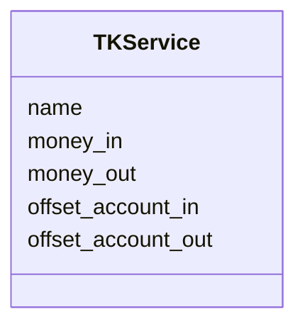
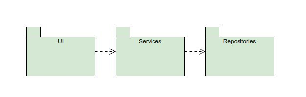
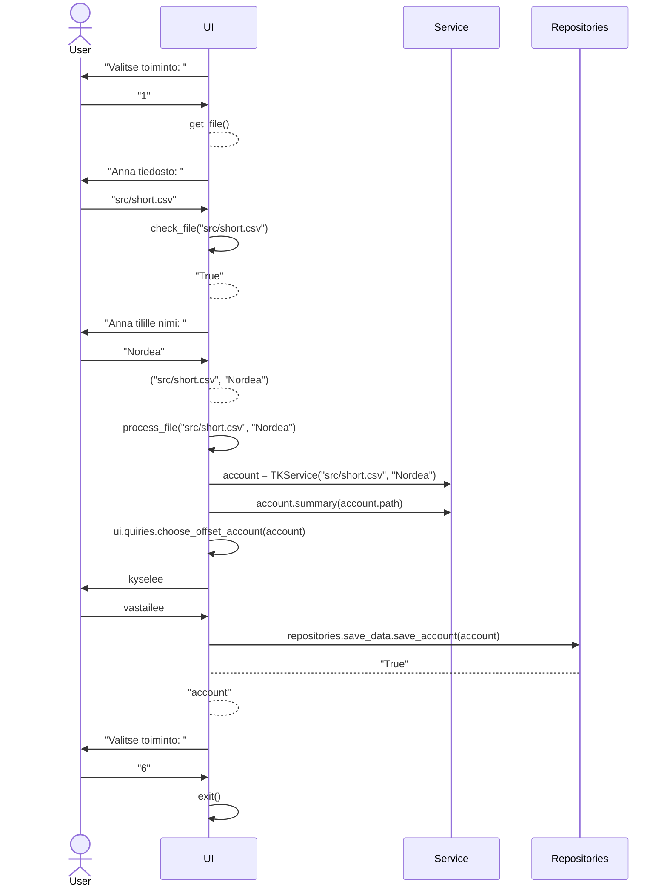
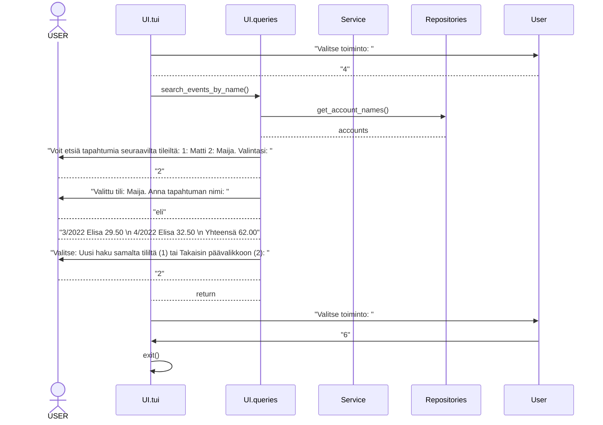

# Kuvaus arkkitehtuurista

## Ohjelman rakenne

Ohjelma koostuu käyttöliittymästä, sovelluslogiikasta ja pysyväistallennuksesta. Käyttöliittymän
alaisuudessa on toimintoja, jotka luonteeltaan ovat käyttöliittymän ja sovelluslogiikan välimaastosta,
sisältäen kuitenkin enemmän käyttöliittymän tyyppisiä toimintoja. 

Sovelluslogiikka käsittelee käyttöliittymän kautta saatuja tietoja ja prosessoi ne muotoon, josta
pysyväistallennuksen kerros saa helposti tallennukseen tarvittavat tiedot. 

## Ohjelman pakkausrakenne

Ohjelma on pakattu toimintoja kuvaaviin kansioihin. UI-kansiossa on käyttöliittymä ja käyttöliittymää
lähellä olevat kyselyt/toiminnot. Service-kansiossa on sovelluslogiikka ja Repositories-kansiossa on 
ohjelman pysyväistallennuksesta vastaavat toiminnot. 

## Päätoiminnallisuus

Ohjelmassa tällä hetkellä olevat toiminnot ovat tiedoston lisääminen, kassavirtalaskelman tulostus, tuloslaskelman tulostus, tilitietojen
haku ja tilien yhdistäminen. Ohjelman käyttö edellyttää aluksi tilitiedoston lisäämistä. Ohjelma pyytää käyttäjää luokittelemaan tilitapahtumat
ja tämän jälkeen tilitiedot tallennetaan pysyväismuistiin. Toistaiseksi kassavirtalaskelman ja tuloslaskelman tulostus tapahtuu tilapäisesti
tallennettujen tietojen varassa. Tilitietojen haku ja tilien yhdistäminen perustuu pysyväisesti tallennettuun tietoon. Tilitietoja voi tällä
hetkellä hakea tilitapahtuman nimen perusteella. Jos useampia tilejä on tallennettu, näiden tiedot on mahdollista yhdistää. Yhdistämisen
jälkeen tapahtumahaussa näkyy muiden tilien joukossa tili Yhdistetty, josta voi hakea tilitapahtumia samaan tapaan kuin muiltakin tileiltä.

### Ohjelman käynnistyminen

### Tilitapahtumien haku

   
   
   

