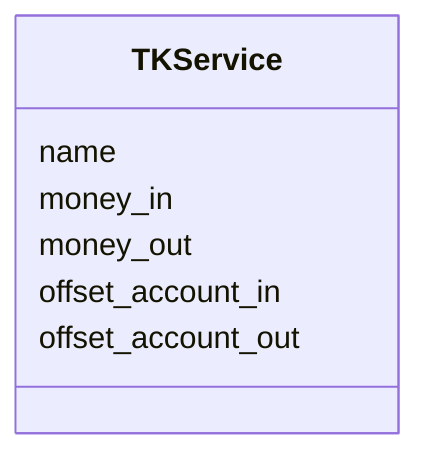

# Kuvaus arkkitehtuurista

## Ohjelman rakenne

Ohjelma koostuu käyttöliittymästä, sovelluslogiikasta ja pysyväistallennuksesta. Käyttöliittymän
alaisuudessa on toimintoja, jotka luonteeltaan ovat käyttöliittymän ja sovelluslogiikan välimaastosta,
sisältäen kuitenkin enemmän käyttöliittymän tyyppisiä toimintoja. 

Sovelluslogiikka käsittelee käyttöliittymän kautta saatuja tietoja ja prosessoi ne muotoon, josta
pysyväistallennuksen kerros saa helposti tallennukseen tarvittavat tiedot. 

## Ohjelman pakkausrakenne

Ohjelma on pakattu toimintoja kuvaaviin kansioihin. UI-kansiossa on käyttöliittymä ja käyttöliittymää
lähellä olevat kyselyt/toiminnot. Service-kansiossa on sovelluslogiikka ja Repositories-kansiossa on 
ohjelman pysyväistallennuksesta vastaavat toiminnot. 

