# Käyttöohje

Lataa projektin viimeisimmän [releasen](https://github.com/rpessi/ot-harjoitustyo/releases/) lähdekoodi 
valitsemalla _Assets_-osion alta _Source code_.

## Ohjelman käynnistäminen

Ennen ohjelman käynnistämistä, asenna riippuvuudet komennolla:

```bash
poetry install
```

Ohjelman voi nyt käynnistää komennolla:

```
poetry run invoke start
```

Invoken kautta käynnistettäessä esiintyy taulukoiden tulostuksessa ongelmia. Tulostusongelmia ei esiinny, kun ohjelma
käynnistetään seuraavilla komennoilla:

```
poetry shell
```

```
poetry run python3 src/index.py
```

Kaikki ylläolevat komennot suoritetaan siinä hakemistossa, mihin ohjelma on ladattu. Tätä hakemistoa kutsutaan
myös reposition juureksi ja tämä ilmaisua saattaa esiintyä myös myöhemmin tässä ohjeessa. 

## Valmistelut ennen ohjelman käyttöä

Jotta voit käyttää ohjelmaa, tarvitset CSV-muotoisen tiliotteen. Ohjelma osaa käsitellä vain Nordean ja S-Pankin CSV-muotoisia tiliotteita. Voit käyttää ohjelman kokeiluun reposition juuressa olevia tiedostoja Nordea.csv ja S-Pankki.csv. Kun ohjelma pyytää antamaan tiedoston nimen ja polun, tässä yhteydessä oleva polku tarkoittaa sitä polkua, jonka päässä tiedosto sijaitsee reposition juuresta katsottuna. Koska kokeiluun tarjotut tiedostot sijaitsevat reposition juuressa, se on ohjelman kannalta katsottuna samassa kansiossa kuin ohjelma itse, joten tällöin riittää antaa ohjelmalle tiedoston nimi - joko Nordea.csv tai S-Pankki.csv. Jos käytät ohjelman kanssa omaa tiedostoa, kannattaa sekin sijoittaa tähän samaan kansioon, jolloin riittää pelkkä tiedoston nimen antaminen eikä sen eteen tarvitse kirjoittaa polkua. 

Kun ohjelma on saanut tiedoston, se pyytää käyttäjää luokittelemaan tilitapahtumat. Tapahtumat voi luokitella seuraaviin luokkiin: Tulot, Menot, Oma tili, Lainat.

Testitiliotteessa short.csv on kaksi eri lainaa. Näiden kuvaus oli identtinen ja siksi niitä on muokattu tekstieditorissa. Ohjelman tämänhetkinen versio ei muodosta vielä tasetta, mutta menoerittelynkin kannalta on mielekkäämpää, että kaksi eri lainaa erottuu toisistaan sen sijaan, että ne olisi laskettu yhteen. Jos käytät tätä tiedostoa ohjelman kokeiluun, voit keksiä korkojen osuuden omasta päästä. Voit antaa korot ilman miinusmerkkiä, ohjelma lisää sen tarvittaessa laskentaa varten.

#### Ohjelman kokeilu omalla tiliotteella

Ohjelma osaa tällä hetkellä lukea vain Nordean ja S-Pankin tiliotteita. Jos haluat kokeilla ohjelmaa jonkun muun pankin tiliotteella, joudut muokkaamaan tiliotetta esimerkiksi tekstieditorissa. 

Nordean tiliotteen otsikkorivi on seuraava: 
```
Kirjauspäivä;Määrä;Maksaja;Maksunsaaja;Nimi;Otsikko;Viitenumero;Valuutta
```
Esimerkki tilitapahtumasta: 
```
2022/12/22;-39,89;FI90 2133 2000 2033 33;;;Elisa Oyj;;EUR
```
Ohjelman käyttämät kentät ovat Kirjauspäivä, Määrä ja Otsikko. Esimerkkitapahtumasta otetaan talteen siis seuraavat tiedot:
```
2022/12/22;-39,89;;;;Elisa Oyj;;
```
eli ensimmäinen, toinen ja kuudes kenttä. Voit siis halutessasi muokata verkkopankkiotteestasi tiedoston, jossa on otsikkorivinä Nordean otsikkorivin mukainen rivi ja sen jälkeen tilitapahtumariveinä seuraavan muotoisia rivejä:
```
2022/12/22;-39,89;;;;Elisa Oyj;;
```

Kirjauspäivä-kentästä ohjelma tallentaa vuoden ([:4]) ja kuukauden ([5:7]). Tällä hetkellä näitä tietoja ei käytetä hakuehtoina, mutta tilitapahtumien haku käyttää näitä tietoja hakutulosten tulostuksessa.

Jos sinulla on lainoja, ohjelma kysyy tilitapahtumien luokittelun yhteydessä lainojen korkojen osuutta. Korkoja ei kysytä jokaisesta lainatapahtumasta erikseen, vaan korkojen määrää kysytään kokonaismääränä. Jos sinulla on esimerkiksi tilitapahtumat puolen vuoden ajalta, ohjelma laskee lainanhoitotapahtumat yhteen ja kysyy, kuinka paljon tähän sisältyy korkoja. Jos käytät omaa tiliotettasi, laske valmiiksi maksettujen korkojen määrä. Jos sinulla on laina, josta maksat pelkkiä korkoja, voit suoraan kirjata sen menoiksi. Ohjelma jakaa korkokulut tasaisesti lainanhoitoerille. Tämä on tietoinen valinta tarkan kirjanpidon ja käyttäjäystävällisyyden välillä. Tämä versio tulostaa joka tapauksessa vain yhteenvedon tilikaudelta, joten mitään arvokasta tietoa ei tällä valinnalla myöskään menetetä. Tilikaudella tarkoitetaan tässä yhteydessä ajanjaksoa, jonka tiliote kattaa. 

Ohjelmassa on toiminto, joka mahdollistaa kaikkien tilien tietojen yhdistämisen. Voit käyttää tätä toimintoa, jos olet tallettanut useamman kuin yhden tilin.

## Ohjelman käyttö

Kun käynnistät ohjelman ensimmäistä kertaa, eikä sinulla ole vielä tallennettuja tilitietoja, ohjelma antaa seuraavanlaisen toimintavalikon:

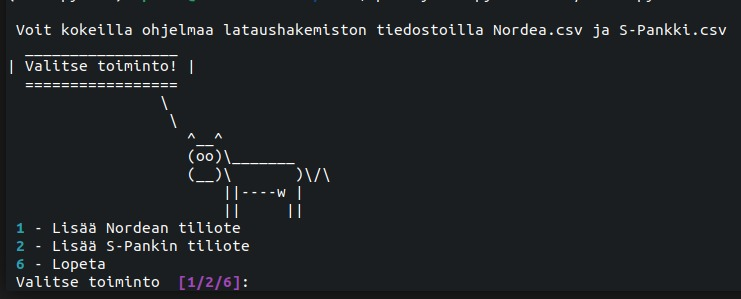

Toimintavalikko näyttää vain käytettävissäsi olevat vaihtoehdot. Alussa voit siis vain antaa tiedoston tai lopettaa ohjelman käytön. 

Aloitetaan ohjelman käyttö Nordean tiliotteella ja annetaan tilin nimeksi Pirjo Python:

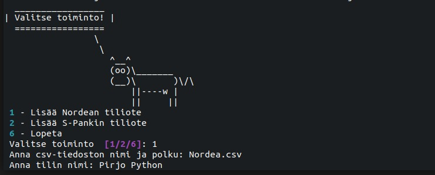

Tiedoston antamisen jälkeen ohjelma siirtyy automaattisesti tilien luokitteluun. Luokittelussa käytetään summia, jotka on laskettu yhteen koko tilikaudelta:

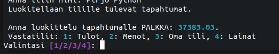

Kun tililtä lähtevä tapahtuma luokitellaan lainaksi, ohjelma kysyy korkojen määrää:

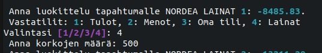

Korkojen määrä annetaan koko siltä ajanjaksolta, jonka tiliotekin kattaa. Jos tiliotteella on vuoden tapahtumat, on tässä kohtaa tarkoitus ilmoittaa koko vuoden korot. Ohjelma jakaa korot tasaisesti lainanlyhennysten välillä ja jakaa tilitapahtuman lainanlyhennykseen ja korkoon.

Luokittelun jälkeen ohjelma palaa toimintavalikkoon, joka on nyt hieman laajentunut:

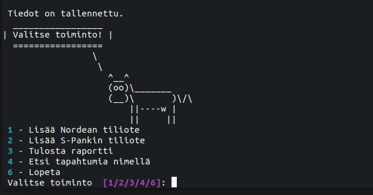

Tallennetusta tiliotteesta voidaan nyt tulostaa raportteja tai tehdä hakuja tapahtuman nimellä.

Tallennetaan ohjelmaan vielä toinen tiliote:

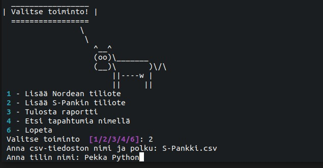

Toimintavalikon kaikki toiminnot ovat nyt käytettävissä:

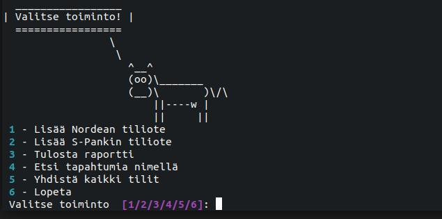

Kokeillaan tilitapahtumien hakua. Tilitapahtumia voi hakea tallennetuilta tileiltä:

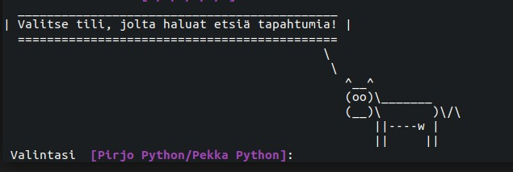

Ohjelma näyttää, minkä tilien tietoja on tallennettu ja tarjoaa mahdollisuutta hakea tapahtumia tietyltä tililtä. Tapahtumia voi hakea niiden nimellä tai nimen alkuosalla. Tapahtuman nimi tarkoittaa tässä maksajaa/maksunsaajaa. Tililtä Pirjo Python voi hakea tietoja puhelinlaskuista tähän tapaan:

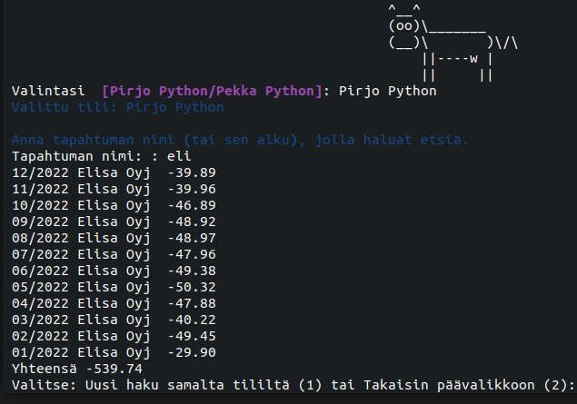

Ohjelma tulostaa löydetyt tapahtumat, minkä jälkeen voi jatkaa tapahtumien hakua samalta tililtä tai palata päävalikkoon.

Kaikkien tilien tiedot voidaan yhdistää toimintavalikon valinnalla 5:

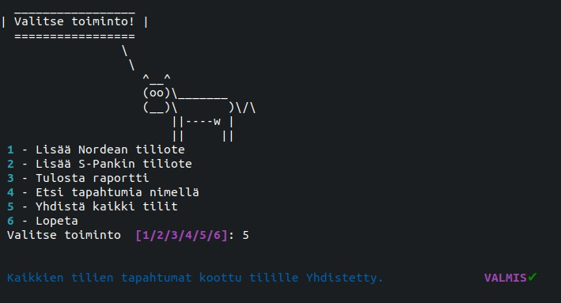

Ohjelma yhdistää kaikki tallennetut tilit samalle tilille. Yhdistämisen jälkeen tapahtumahaussa näkyy aiemmin talletettujen tilien lisäksi myös tili Yhdistetty. Tililtä Yhdistetty voit tehdä tapahtumahakuja samaan tapaan kuin muiltakin tileiltä.


Päävalikosta päästään raporttien tulostukseen valinnalla 3:

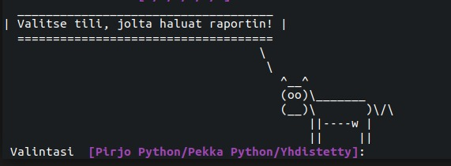

Ohjelman tuloste, kun on valittu tarjolla olevista vaihtoehdoista tili Yhdistetty ja valittu raportin tyypiksi 1 (tuloslaskelma):

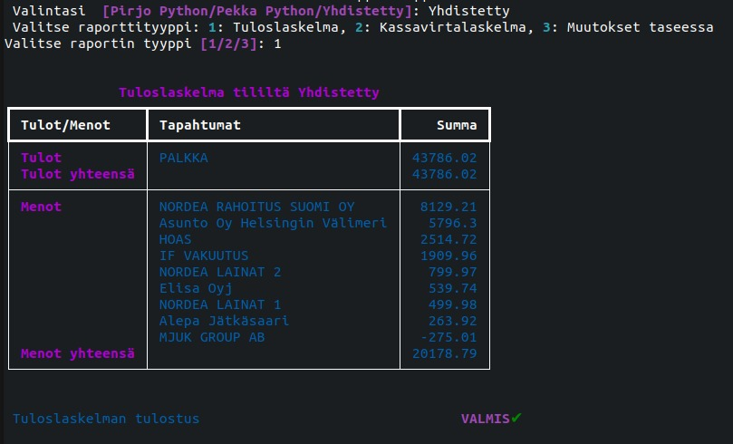

Tapahtuma MJUK GROUP näkyy menoissa miinusmerkkisenä, koska se on tilille tullut talletus, joka on luokiteltu menoksi. Luokittelussa on otettu huomioon, että kyseessä on irtaimiston myynnistä saatu raha ja on haluttu kirjata se pienentämään menopuolta sen sijaan, että se olisi merkitty tuloksi.

Kun valitaan samalta tililtä kassavirtalaskelma, saadaan seuraavanlainen tuloste:

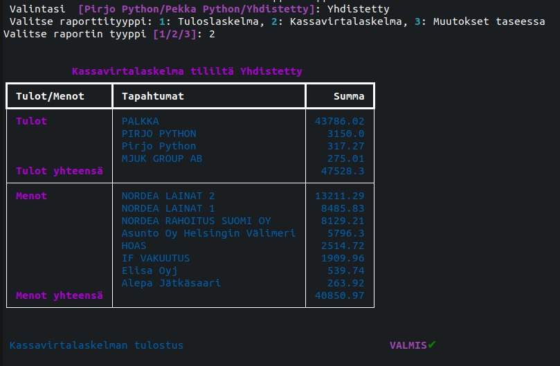

Kassavirtalaskelmassa näkyy tapahtumia, joita ei näy tuloslaskelmassa. Tulopuolella on tapahtumia nimellä Pirjo Python. Nämä ovat tilille tulleita talletuksia, joissa maksajana on Pirjo Python ja tilitapahtumien luokittelussa näiden luokaksi on valittu Oma tili. Nähdään siis, että tilille on tullut rahaa, mutta koska kyseessä on tilisiirto omien tilien välillä, tämä ei näy tulona. MJUK GROUP näkyy myös tulona, koska tilille on tullut rahaa. Kassavirtalaskelma on siis tietyllä tapaa sokea sille, mikä on rahan lähde. Jos tilitapahtumissa olisi lainaksi kirjattu opintolainan nosto, se näkyisi tässä myös tulona. Vastaavasti kaikki tililtä lähtevät summat näkyvät menoina riippumatta siitä, onko kyseessä lainanlyhennys vai todellinen meno.

Kun valitaan samalta tililtä raporttimuodoksi muutokset tase-erissä, saadaan seuraavanlainen tuloste:

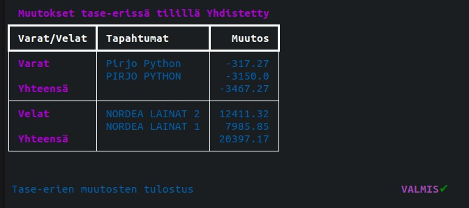

Tase-erien muutoksissa näkyvät muutokset varoissa ja veloissa. Varoissa näkyvät omat tilit, joiden tietoja ei ole tallennettu ohjelmaan. Tulosteesta on nähtävillä, että Pirjo Pythonilla on kaksi muuta tiliä sen tilin lisäksi, joka hänellä on Nordeassa. Tase-erissä näkyvät negatiiviset muutokset kuvastavat sitä, että näiden tilien saldo on pienentynyt. Tämä on luonnollista, koska kassavirtalaskelmasta nähtiin, että Pirjo on siirtänyt näiltä tileiltä rahaa Nordeassa olevalle tilillleen. Jos Pirjo tallentaisi näidenkin tilien tiliotteet ohjelmaan, tässä kohtaa näkyisi vastaavat muutokset Nordean tilillä, mutta plusmerkkisinä ja muutosten yhteismäärä olisi 0.

Muutokset lainoissa näkyvät positiivisina, koska tililtä on lähtenyt rahaa ja lainat ajatellaan taseessa negatiivisina summina. Muutokset lainoissa kuvastavat sitä, kuinka paljon rahaa lainojen lyhennyksiin on mennyt.


