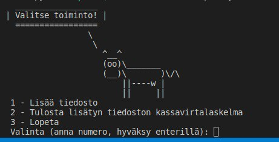

# Käyttöohje

Lataa projektin viimeisimmän [releasen](https://github.com/rpessi/ot-harjoitustyo/releases) lähdekoodi 
valitsemalla _Assets_-osion alta _Source code_.

## Ohjelman käynnistäminen

Ennen ohjelman käynnistämistä, asenna riippuvuudet komennolla:

```bash
poetry install
```

Suorita tämän jälkeen alustustoimenpiteet komennolla:

```bash
poetry run invoke build
```

Ohjelman voi nyt käynnistää komennolla:

```
poetry run invoke start
```

## Valmistelut ennen ohjelman käyttöä

Jotta voit käyttää ohjelmaa, tarvitset CSV-muotoisen tiliotteen. Ohjelmassa ei ole vielä konfiguraatioita eri pankkien
tiliotteille ja tällä hetkellä se osaa käsitellä vain Nordean CSV-muotoisia tiliotteita. Voit käyttää ohjelman kokeiluun
src-kansiossa olevia tiedostoja short.csv ja long.csv. Tiedostossa short.csv on rajattu määrä tilitapahtumia ja sen käyttö
on suositeltavaa tässä kohtaa, kun ohjelma ei tee vielä mitään jännittävää. Ohjelma pyytää käyttäjää luokittelemaan 
tilitapahtumat, joten kannattaa aloittaa kokeilu tällä lyhyemmällä tiliotteella. Voit halutessasi käyttää myös omaa 
tiliotettasi, jos se on Nordean tiliote. Vaihtoehtoisesti voit muokata jonkun muun pankin tiliotteen vastaamaan
Nordean tiliotetta. 

Nordean tiliotteen otsikkorivi on seuraava: Kirjauspäivä;Määrä;Maksaja;Maksunsaaja;Nimi;Otsikko;Viitenumero;Valuutta

Esimerkki tilitapahtumasta: 2022/12/22;-39,89;FI90 2133 2000 2033 33;;;Elisa Oyj;;EUR

Ohjelman käyttämät kentät ovat Kirjauspäivä, Määrä ja Otsikko. Esimerkkitapahtumasta otetaan talteen siis seuraavat tiedot:
2022/12/22;-39,89;;;;Elisa Oyj;; eli ensimmäinen, toinen ja kuudes kenttä. (Tässä versiossa päivämäärä tallennetaan, mutta
tietoa ei vielä käytetä mihinkään, joten ei haittaa vaikka päivämääräkenttä olisi eri muodossa tai puuttuisi kokonaan.)
Voit siis halutessasi muokata verkkopankkiotteestasi tiedoston, jossa on otsikkorivinä Nordean otsikkorivin mukainen rivi
ja sen jälkeen tilitapahtumariveinä joko 2022/12/22;-39,89;;;;Elisa Oyj;; tai ;-39,89;;;;Elisa Oyj;; -muotoisia rivejä.

Jos sinulla on lainoja, ohjelma kysyy tilitapahtumien luokittelun yhteydessä lainojen korkojen osuutta. Korkoja ei kysytä
jokaisesta lainatapahtumasta erikseen, vaan korkojen määrää kysytään kokonaismääränä. Jos sinulla on esimerkiksi tilitapahtumat
puolen vuoden ajalta, ohjelma laskee lainanhoitotapahtumat yhteen ja kysyy, kuinka paljon tähän sisältyy korkoja. Jos käytät
omaa tiliotettasi, laske valmiiksi maksettujen korkojen määrä. Jos sinulla on laina, josta maksat pelkkiä korkoja, voit
suoraan kirjata sen menoiksi. Ohjelma jakaa korkokulut tasaisesti lainanhoitoerille. Tämä on tietoinen valinta tarkan
kirjanpidon ja käyttäjäystävällisyyden välillä. Tämä versio tulostaa joka tapauksessa vain yhteenvedon tilikaudelta, joten
mitään arvokasta tietoa ei tällä valinnalla myöskään menetetä.

Testitiliotteessa short.csv on kaksi eri lainaa. Näiden kuvaus oli identtinen ja siksi niitä on muokattu tekstieditorissa. 
Ohjelman tämänhetkinen versio ei muodosta vielä tasetta, mutta menoerittelynkin kannalta on mielekkäämpää, että kaksi eri lainaa
erottuu toisistaan sen sijaan, että ne olisi laskettu yhteen.

## Ohjelman käyttö

Ohjelma käynnistyy terminaalissa ja antaa toimintavalikon:



Valinnat ovat vielä vähissä, koska pysyväistallennettua tietoa ei päästä vielä käyttämään. Ennen kuin voit tulostaa 
kassavirtalaskelman, sinun täytyy antaa tiliotetiedosto ja luokitella tilitapahtumat. 


