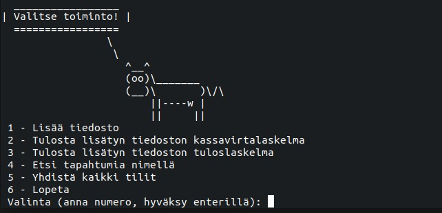

# Käyttöohje

Lataa projektin viimeisimmän [releasen](https://github.com/rpessi/ot-harjoitustyo/releases/) lähdekoodi 
valitsemalla _Assets_-osion alta _Source code_.

## Ohjelman käynnistäminen

Ennen ohjelman käynnistämistä, asenna riippuvuudet komennolla:

```bash
poetry install
```

Suorita tämän jälkeen alustustoimenpiteet komennolla:

```bash
poetry run invoke build
```

Ohjelman voi nyt käynnistää komennolla:

```
poetry run invoke start
```

## Valmistelut ennen ohjelman käyttöä

Jotta voit käyttää ohjelmaa, tarvitset CSV-muotoisen tiliotteen. Ohjelmassa ei ole vielä konfiguraatioita eri pankkien
tiliotteille ja tällä hetkellä se osaa käsitellä vain Nordean CSV-muotoisia tiliotteita. Voit käyttää ohjelman kokeiluun
src-kansiossa olevia tiedostoja short.csv ja long.csv. Tiedostossa short.csv on rajattu määrä tilitapahtumia ja ohjelman
kokeilu kannattaa aloittaa sillä. Kun ohjelma on saanut tiedoston, se pyytää käyttäjää luokittelemaan tilitapahtumat. 
Tapahtumat voi tällä hetkellä luokitella seuraaviin luokkiin: Tulot, Menot, Oma tili, Lainat.

Testitiliotteessa short.csv on kaksi eri lainaa. Näiden kuvaus oli identtinen ja siksi niitä on muokattu tekstieditorissa. 
Ohjelman tämänhetkinen versio ei muodosta vielä tasetta, mutta menoerittelynkin kannalta on mielekkäämpää, että kaksi eri lainaa
erottuu toisistaan sen sijaan, että ne olisi laskettu yhteen. Jos käytät tätä tiedostoa ohjelman kokeiluun, voit keksiä korkojen
osuuden omasta päästä.

#### Ohjelman kokeilu omalla tiliotteella

Ohjelma osaa tällä hetkellä lukea vain Nordean tiliotteita. Jos haluat kokeilla ohjelmaa jonkun muun pankin tiliotteella,
joudut muokkaamaan tiliotetta esimerkiksi tekstieditorissa.

Nordean tiliotteen otsikkorivi on seuraava: Kirjauspäivä;Määrä;Maksaja;Maksunsaaja;Nimi;Otsikko;Viitenumero;Valuutta

Esimerkki tilitapahtumasta: 2022/12/22;-39,89;FI90 2133 2000 2033 33;;;Elisa Oyj;;EUR

Ohjelman käyttämät kentät ovat Kirjauspäivä, Määrä ja Otsikko. Esimerkkitapahtumasta otetaan talteen siis seuraavat tiedot:
2022/12/22;-39,89;;;;Elisa Oyj;; eli ensimmäinen, toinen ja kuudes kenttä. Voit siis halutessasi muokata verkkopankkiotteestasi
tiedoston, jossa on otsikkorivinä Nordean otsikkorivin mukainen rivi ja sen jälkeen tilitapahtumariveinä 
2022/12/22;-39,89;;;;Elisa Oyj;; -muotoisia rivejä.

Kirjauspäivä-kentästä ohjelma tallentaa vuoden ([:4]) ja kuukauden ([5:7]). Tällä hetkellä näitä tietoja ei käytetä hakuehtoina,
mutta tilitapahtumien haku käyttää näitä tietoja hakutulosten tulostuksessa.

Jos sinulla on lainoja, ohjelma kysyy tilitapahtumien luokittelun yhteydessä lainojen korkojen osuutta. Korkoja ei kysytä
jokaisesta lainatapahtumasta erikseen, vaan korkojen määrää kysytään kokonaismääränä. Jos sinulla on esimerkiksi tilitapahtumat
puolen vuoden ajalta, ohjelma laskee lainanhoitotapahtumat yhteen ja kysyy, kuinka paljon tähän sisältyy korkoja. Jos käytät
omaa tiliotettasi, laske valmiiksi maksettujen korkojen määrä. Jos sinulla on laina, josta maksat pelkkiä korkoja, voit
suoraan kirjata sen menoiksi. Ohjelma jakaa korkokulut tasaisesti lainanhoitoerille. Tämä on tietoinen valinta tarkan
kirjanpidon ja käyttäjäystävällisyyden välillä. Tämä versio tulostaa joka tapauksessa vain yhteenvedon tilikaudelta, joten
mitään arvokasta tietoa ei tällä valinnalla myöskään menetetä.

Tällä hetkellä ohjelmassa ei ole toimintoa, jolla voisi yhdistää eri tilien tapahtumat toisiinsa. Jos haluat tutkia eri tilien
tapahtumia yhtenä kokonaisuutena, yhdistä tilien tapahtumat samaan csv-tiedostoon ennen kuin annat sen ohjelman tallennettavaksi.

## Ohjelman käyttö

Ohjelma käynnistyy terminaalissa ja antaa toimintavalikon:



Kun käytät ohjelmaa ensimmäistä kertaa, pitää sinun aluksi antaa ohjalmelle tallennettava tiedosto. Ohjelma kysyy tiedoston nimeä
ja sijaintia ja pyytää sinua myös antamaan tilille nimen. Tiedoston antamisen jälkeen ohjelma pyytää sinulta tilitapahtumien
luokittelua. Tällä hetkellä luokittelussa ovat vaihtoehtoina vain Tulot, Menot, Oma tili ja Lainat. Kun olet luokitellut kaikki
tilitapahtumat, pääset käyttämään valikon vaihtoehtoja 2-5. Valinnasta 5 on hyötyä vain, jos olet tallettanut vähintään kaksi tiliä.

Ohjelma käyttää tilapäisesti tallennettuja tietoja vaihtoehdoissa 2-3. Nämä valinnat tarjoavat mahdollisuuden tulostaa ruudulle viimeksi
tallennetun tilin Kassavirtalaskelman ja Tuloslaskelman. Kassavirtalaskelmassa on kaikki tilille tulevat panot ja tililtä lähtevät
tilisiirrot. Tuloslaskelmassa on poistettu näistä tapahtumista tilisiirrot omille tileille sekä lainojen lyhennykset.

Valikon vaihtoehdolla 4 pääset tekemään kyselyjä tallennetuista tilitiedoista. Tämä toiminto hyödyntää pysyvästi tallennettuja tietoja,
joten voit tehdä kyselyjä myös aiemmin talletetuista tilitiedoista.

Kun olet antanut tilitietoja tallennettavaksi ja valitset päävalikosta vaihtoehdon 4, tulet tilitapahtumien hakuun:


Ohjelma näyttää, minkä tilien tietoja on tallennettu ja tarjoaa mahdollisuutta hakea tapahtumia tietyltä tililtä. Toistaiseksi on
tarjolla vain tapahtuman haku nimellä. Tapahtuman nimi on tiliotteessa näkyvä maksaja/maksunsaaja. Voit hakea tapahtumaa myös
sen alkuosalla ja käyttää pieniä kirjaimia tähän tapaan: 


Ohjelma tulostaa löydetyt tapahtumat, jonka jälkeen voit jatkaa tapahtumien hakua samalta tililtä tai palata päävalikkoon.

Jos olet tallettanut useampia tilejä, voit valita päävalikossa valinnan 5. Tämän jälkeen tapahtumahaussa näkyy myös tili Yhdistetty,
jolta voit tehdä tapahtumahakuja samaan tapaan kuin muiltakin tileiltä.


Yhdistetyllä tilillä näkyy koottuna kaikkien muiden tilien samannimiset tapahtumat.


