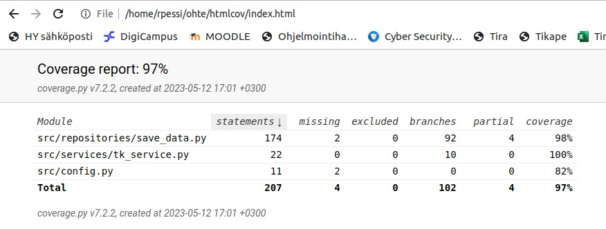
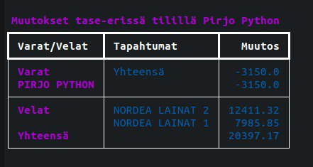

# Testausdokumentti

Ohjelman toimintaa on testattu automatisoituilla yksikkö- ja integraatiotason unit-testeillä ja manuaalisesti tapahtuineilla järjestelmätason testeillä. Kaikki automatisoidut unit-testit ovat yhteisessä testiluokassa [TestTKService](https://github.com/rpessi/ot-harjoitustyo/blob/main/src/tests/tkservice_test.py). 

## Yksikkö- ja integraatiotason testaus

### Sovelluslogiikka

Ohjelman sovelluslogiikka käsittää osion, jossa käsitellään ja prosessoidaan tilapäisesti tallennettua tietoa, kunnes kaikki tarvittava tieto on saatu koottua tallennusta varten. Testiluokassa alustetaan testausta varten tiliolio, jolle annetaan attribuutteina vastaavia tietoja, joita ohjelma saisi normaalisti käyttöliittymän kautta käyttäjältä. Tilitapahtumien luokittelu on osa tätä alustusta. Sovelluslogiikkaa testataan kahdella testillä, jotka tarkistavat, että sovelluslogiikan laskemassa yhteenvedossa summat ovat oikein. Koska ohjelman käyttö perustuu käyttäjältä saatuun tiliotetiedostoon ja siitä saataviin tapahtumiin ja niiden luokitteluun, testiluokan käytössä on kolme erilaista tiliotetta, joita käytetään ohjelman automaattitestauksessa.

### Repositorio

Repositorio-osion testeissä on sekä yksikkö- että integraatiotason testejä. Repositorio-osiossa tiedot tallennetaan ensin csv-tiedostoon, johon tulee kaikkien tilien tiedot. Yksittäisen toiminnon lisäksi testataan erilaisia ohjelman käytössä esiin tulevia tilanteita. Esimerkiksi funktiota, joka yhdistää kaksi tiliotetta, on testattu kahdella erilaisella tiliotteella ja kahdella eri tilioliolla, ikään kuin kaksi eri käyttäjää olisivat tallentaneet tilinsä ja muodostaneet näistä ohjelman avulla yhdistetyn tilin tapahtumahakua ja raportteja varten. Testeistä odotetut tulokset on laskettu Excelillä ja testeistä saatuja tuloksia on verrattu niihin. 

S-Pankin tiliotetta muokkaavaa toimintoa on testattu automaattisesti vain tarkistamalla, että se tuottaa pyydetyn testitiedoston oikeaan paikkaan. Muokatun tiliotteen toimivuus on varmennettu manuaalisella testauksella.

### Manuaalinen testaus

Käyttöliittymää on testattu manuaalisesti koko ohjelman kehityksen ajan ja tämän testauksen myötä on saatu varmennettua ohjelman toimivuus niiltä osin, kuin automaattitestaus ei sitä kata. Ohjelman käyttöä alusta alkaen on kokeiltu useampaan kertaan ja sen käyttöä on kokeiltu useilla erilaisilla tiliotteilla. Manuaalitestauksessa on myös hyödynnetty aiempia pysyväisesti tallennettuja tietoja niiltä osin, kun on haluttu testata raporttien tulostuksen toimivuutta ja käyttöliittymän käyttöä tilanteessa, kun pysyväisesti tallennettuja tietoja on jo käytettävissä. 

### Testauskattavuus

Käyttöliittymäkerros poislukien testien haaraumakattavuus on 97%. 



Osa puuttuvista riveistä liittyy erityistilanteeseen, mitä ei testiaineistossa esiintynyt eikä sen generoiminen myöskään tuntunut vaivan arvoiselta. Automaattitestien ulkopuolelle jäävät tilanteet tuli kuitenkin käytyä läpi manuaalisessa testauksessa. 

### Järjestelmätestaus

Ohjelman järjestelmätestaus on suoritettu manuaalisesti. Tässä testauksessa on ilmennyt, että ohjelman käynnistäminen komennolla 
```bash
poetry run invoke start
```

tuottaa virheitä ohjelman tulostuksessa. Käyttöohjeeseen on lisätty tästä maininta ja myös ohjeet siitä, millä komennoilla ohjelma kannattaa käynnistää, jotta tulostusvirheiltä vältytään.

### Sovelluksen asennus

Ohjelma on haettu ja sitä on testattu manuaalisesti [käyttöohjeessa](./kayttoohje.md) kuvatulla tavalla Linux-ympäristössä. Ohjelmaa on testattu tilanteissa, joissa ohjelman käyttö aloitetaan alusta ja myös tilanteissa, joissa ohjelma käynnistetään tauon jälkeen ja siellä on pysyväistallennettuja tietoja valmiiksi. 

### Toiminnallisuudet

Kaikki [määrittelydokumentin](./vaatimusmaarittely.md#perusversion-tarjoama-toiminnallisuus) ja käyttöohjeissa esitellyt toiminnallisuudet on käyty läpi useampaan kertaan. Toiminnallisuuksien yhteydessä olevia syötekenttiä on testattu monilla erilaisilla virhesyötteillä. 

### Sovellukseen jääneet laatuongelmat

Raportti tase-erien muutoksista ei tulostu järkevällä tavalla, jos tase-eriä on liian vähän.




