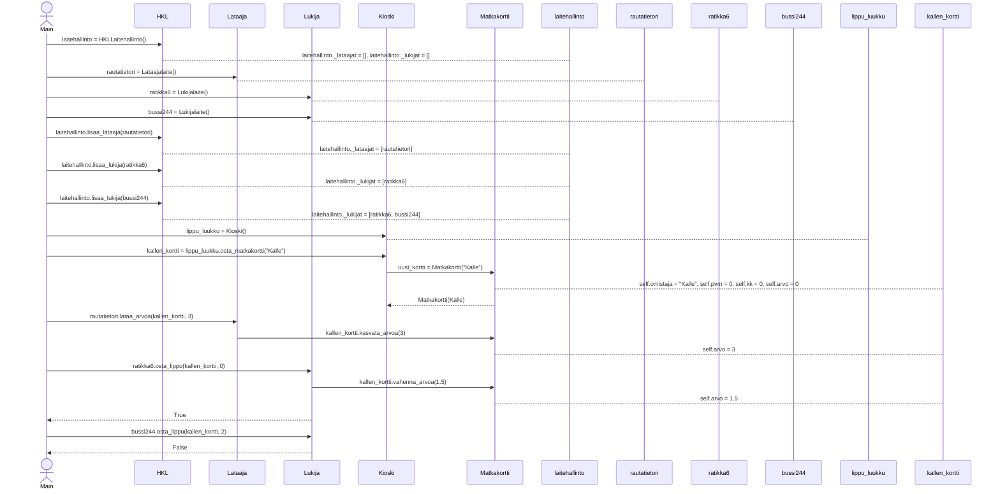

```mermaid
sequenceDiagram;
    actor Main as Main;
    participant HKLLaitehallinto as HKL;
    participant Lataajalaite as Lataaja;
    participant Lukijalaite as Lukija;
    participant Kioski as Kioski;
    participant Matkakortti as Matkakortti;
    participant laitehallinto as laitehallinto;
    participant rautatietori as rautatietori;
    participant ratikka6 as ratikka6;
    participant bussi244 as bussi244;
    Main->>HKLLaitehallinto: laitehallinto = HKLLaitehallinto();
    HKLLaitehallinto-->laitehallinto: laitehallinto._lataajat = [], laitehallinto._lukijat = [];
    Main->>Lataajalaite: rautatietori = Lataajalaite();
    Lataajalaite-->rautatietori: ;
    Main->>Lukijalaite: ratikka6 = Lukijalaite();
    Lukijalaite-->ratikka6: ;
    Main->>Lukijalaite: bussi244 = Lukijalaite();
    Lukijalaite-->bussi244: ;
    Main->>HKLLaitehallinto: laitehallinto.lisaa_lataaja(rautatietori);
    HKLLaitehallinto-->laitehallinto: laitehallinto._lataajat = [rautatietori];
    Main->>HKLLaitehallinto: laitehallinto.lisaa_lukija(ratikka6);
    HKLLaitehallinto-->laitehallinto: laitehallinto._lukijat = [ratikka6];
    Main->>HKLLaitehallinto: laitehallinto.lisaa_lukija(bussi244);
    HKLLaitehallinto-->laitehallinto: laitehallinto._lukijat = [ratikka6, bussi244];
    Main->>Kioski: lippu_luukku = Kioski();
    Kioski-->lippu_luukku: ;
    Main->>Kioski: kallen_kortti = lippu_luukku.osta_matkakortti("Kalle");
    Kioski->>Matkakortti: uusi_kortti = Matkakortti("Kalle");
    Matkakortti-->kallen_kortti: self.omistaja = "Kalle", self.pvm = 0, self.kk = 0, self.arvo = 0;
    Matkakortti-->>Kioski: Matkakortti(Kalle);
    Main->>Lataajalaite: rautatietori.lataa_arvoa(kallen_kortti, 3);
    Lataajalaite->>Matkakortti: kallen_kortti.kasvata_arvoa(3);
    Matkakortti-->kallen_kortti: self.arvo = 3;
    Main->>Lukijalaite: ratikka6.osta_lippu(kallen_kortti, 0);
    Lukijalaite->>Matkakortti: kallen_kortti.vahenna_arvoa(1.5);
    Matkakortti-->kallen_kortti: self.arvo = 1.5;
    Lukijalaite-->>Main: True;
    Main->>Lukijalaite: bussi244.osta_lippu(kallen_kortti, 2);
    Lukijalaite-->>Main: False;
```
